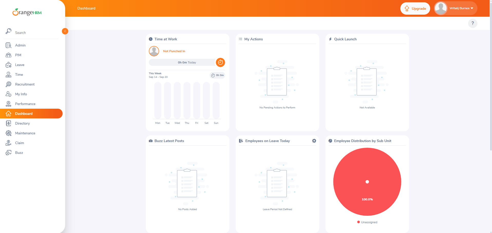

# OrangeHRM Product Overview

## Document Information

| Field | Value |
|---|---|
| System under test | OrangeHRM Starter |
| Version | 5.9 |
| Environment | Local Docker environment |
| Application URL | http://localhost:8080 |
| Document status | Ready for Review |
| Related issue | #1 |

## Product Purpose

OrangeHRM Starter is an open-source Human Resource Management System
designed to support employee and HR administration processes.

The application allows an organization to maintain employee records,
manage system users and access roles, process leave requests, track
working time, manage performance-related information, and provide
employees with self-service functionality.

This portfolio project focuses on employee records and related system
access management.

## Target Users

### HR Administrator

An HR Administrator manages employee records, organizational
information, and HR-related processes.

Typical activities include:

- Creating and updating employee records
- Searching and filtering employees
- Managing employment information
- Uploading employee documents
- Maintaining personnel data

### System Administrator

A System Administrator manages application access.

Typical activities include:

- Creating system users
- Linking users to employees
- Assigning user roles
- Enabling and disabling accounts
- Editing and deleting users

### Employee Self-Service User

An Employee Self-Service user accesses personal and employee-facing
functionality through an ESS account.

During the initial exploration, the ESS user had access to:

- Search
- Leave
- Time
- My Info
- Performance
- Dashboard
- Directory
- Claim
- Buzz

The ESS user did not have access to the Admin or PIM modules.

## Selected Modules

### Authentication

The Authentication module controls access to OrangeHRM.

The explored functionality includes:

- Username and password authentication
- Password masking and visibility control
- Password recovery
- Redirecting authenticated users to the Dashboard
- User profile access
- Logout
- Protection of authenticated pages after logout

### PIM and Employee Management

The PIM module stores and manages employee information.

The explored functionality includes:

- Creating an employee
- Automatically generating an Employee ID
- Viewing and editing personal details
- Searching and filtering employees
- Displaying employees in a table
- Opening an employee profile from the list
- Selecting employee records
- Individual and bulk deletion controls
- Uploading an employee photograph
- Adding attachments
- Accessing additional employee-information sections

### Admin and User Management

The User Management area controls application accounts and access.

The explored functionality includes:

- Creating a system user
- Linking a system user to an employee
- Assigning the Admin or ESS role
- Setting the user status to Enabled or Disabled
- Searching and filtering system users
- Displaying system users in a table
- Editing and deleting system users
- Applying role-based access restrictions

## Primary Entities

### Employee

An Employee represents a personnel record stored in the PIM module.

The employee record can contain:

- Personal information
- Employee ID
- Contact information
- Emergency contacts
- Dependents
- Immigration information
- Job information
- Salary information
- Supervisor relationships
- Qualifications
- Memberships
- Attachments

An Employee record does not automatically provide access to the
OrangeHRM application.

### System User

A System User represents an account that can authenticate in the
OrangeHRM application.

The user account contains:

- Username
- Password
- User role
- Account status
- Linked employee

A System User is linked to an existing Employee record.

### User Role

A User Role determines which modules and operations are available
to the authenticated user.

The explored roles are:

- Admin
- ESS

The Admin role can access administration and employee-management
functionality. The ESS role has restricted access and cannot access
the Admin or PIM modules.

### User Status

A System User can have one of the following statuses:

- Enabled
- Disabled

An enabled user can authenticate using valid credentials. The effect
of the Disabled status will be verified during functional testing.

## Entity Relationships

The explored functionality uses the following relationships:

1. An Employee is created and stored in the PIM module.
2. A System User is created separately in User Management.
3. The System User is linked to an existing Employee.
4. The User Role defines the modules available to the System User.
5. The User Status determines whether the account is enabled or disabled.

The portfolio test data uses the following relationship:

| Employee | Employee ID | System User | Role | Status |
|---|---:|---|---|---|
| QA Portfolio Employee | 005 | qa_portfolio_ess | ESS | Enabled |

OrangeHRM also uses an internal employee number in application URLs.
For the test employee, the visible Employee ID is `005`, while the
profile URL contains the internal employee number `5`.

## Primary Business Flow

The primary business flow selected for this project is employee
onboarding and system-access management.

### Preconditions

- OrangeHRM is available.
- An administrator account exists.
- The administrator is authenticated.
- The required user role is configured.

### Flow

1. The administrator opens the PIM module.
2. The administrator creates a new Employee record.
3. OrangeHRM generates an Employee ID.
4. The application saves the Employee and opens the Personal Details page.
5. The administrator opens Admin → User Management.
6. The administrator creates a new System User.
7. The System User is linked to the previously created Employee.
8. The administrator assigns the ESS role.
9. The administrator sets the account status to Enabled.
10. The ESS user authenticates using the created credentials.
11. OrangeHRM displays the Dashboard.
12. The ESS user can access only the modules permitted by the assigned role.
13. The ESS user cannot access the Admin or PIM modules.
14. The ESS user logs out.
15. OrangeHRM terminates the authenticated session and returns the user
    to the Login page.

### Result

A personnel record and a related application account are created.
The user can authenticate and access functionality permitted by the
ESS role.

## Navigation Map

### Authentication

- Login
- Forgot Password
- Dashboard
- User Profile Menu
  - Logout

### PIM

- Configuration
  - Optional Fields
  - Custom Fields
  - Data Import
  - Reporting Methods
  - Termination Reasons
- Employee List
- Add Employee
- Reports

### Employee Profile

- Personal Details
- Contact Details
- Emergency Contacts
- Dependents
- Immigration
- Job
- Salary
- Report-to
- Qualifications
- Memberships

### Admin

- User Management
  - Users
- System User Search
- Add System User
- Edit System User
- Delete System User

## Initial Questions and Observations

### Authentication Exploration

- Login URL: http://localhost:8080/web/index.php/auth/login
- Browser page title: OrangeHRM
- Input fields:
  - Username
  - Password
- Field placeholders:
  - Username: Username
  - Password: Password
- Available buttons:
  - Login
- Password recovery: Available through the "Forgot your password?" link
- Password masking: Password characters are displayed as dots
- Password visibility control: Yes
- Successful login redirects to: http://localhost:8080/web/index.php/dashboard/index
- Successful login indicators:
  - Dashboard page is displayed
  - Application sidebar is available
  - User profile menu is displayed in the upper-right corner
- Logout location: User profile menu in the upper-right corner
- Logout redirects to: http://localhost:8080/web/index.php/auth/login
- Protected page displayed after browser Back: No
- Protected page functional after browser Back: No
- Direct access to Dashboard after Logout: No; the user is redirected to the Login page
- Additional observations:
  - The Login page contains a link to the official OrangeHRM website

### PIM Navigation and Employee List Exploration

- PIM URL: http://localhost:8080/web/index.php/pim/viewEmployeeList
- Browser page title: OrangeHRM
- Top navigation items:
  - Configuration
  - Employee List
  - Add Employee
  - Reports
- Configuration menu items:
  - Optional Fields
  - Custom Fields
  - Data Import
  - Reporting Methods
  - Termination Reasons
- Employee search fields:
  - Employee Name
  - Employee ID
  - Employment Status
  - Include
  - Supervisor Name
  - Job Title
  - Sub Unit
- Search form buttons:
  - Reset
  - Search
- Confirmed autocomplete fields:
  - Employee Name
- Autocomplete behavior for Supervisor Name: Not verified during initial exploration
- Search filters can be reset: Yes
- Number of employee records during initial exploration: 2
- Employee table columns:
  - ID
  - First and Middle Name
  - Last Name
  - Job Title
  - Employment Status
  - Sub Unit
  - Supervisor
  - Actions
- Row selection checkbox: Yes
- Available row actions:
  - Edit
  - Delete
- Multiple employee selection: Yes
- Bulk delete action: Yes
- Pagination: Not displayed because the initial result contained only two records
- Column sorting: Available for all data columns except Actions
- Additional observations: None at this stage

### Employee Creation and Profile Exploration

- Add Employee URL: http://localhost:8080/web/index.php/pim/addEmployee
- Add Employee fields:
  - First Name
  - Middle Name
  - Last Name
  - Employee ID
  - Employee Photograph
- Required fields:
  - First Name
  - Last Name
- Employee ID generated automatically: Yes
- Generated Employee ID: 004
- Create Login Details option: Available
- Additional fields displayed when Create Login Details is enabled:
  - Username
  - Password
  - Confirm Password
- Required login fields:
  - Username
  - Password
  - Confirm Password
- Test employee: QA Portfolio Employee
- Save notification: Displayed, but the exact text was not recorded during initial exploration
- Redirect after creation: The application redirects to the employee's Personal Details page
- Employee profile URL: http://localhost:8080/web/index.php/pim/viewPersonalDetails/empNumber/4
- Internal employee number from URL: 4
- Employee profile sections:
  - Personal Details
  - Contact Details
  - Emergency Contacts
  - Dependents
  - Immigration
  - Job
  - Salary
  - Report-to
  - Qualifications
  - Memberships
- Personal Details fields:
  - First Name
  - Middle Name
  - Last Name
  - Employee ID
  - Other ID
  - Driver's License Number
  - License Expiry Date
  - Nationality
  - Marital Status
  - Date of Birth
  - Gender
- Employee details can be edited and saved: Yes
- Employee ID displayed in profile: Yes
- Employee found in Employee List: Yes
- Employee List displays the correct name and Employee ID: Yes
- Employee profile can be reopened from the Employee List: Yes
- Photograph requirements:
  - Supported formats: JPG, PNG, and GIF
  - Maximum file size: 1 MB
  - Recommended dimensions: 200 × 200 pixels
- Attachments section:
  - A file can be selected
  - A comment can be added
- Additional observations:
  - The visible Employee ID differs from the internal employee number used in the profile URL

### User Management Exploration

- User Management URL: http://localhost:8080/web/index.php/admin/viewSystemUsers
- Search fields:
  - Username
  - User Role
  - Employee Name
  - Status
- Available User Role values:
  - Admin
  - ESS
- Available Status values:
  - Enabled
  - Disabled
- Autocomplete fields:
  - Employee Name
- Search form buttons:
  - Reset
  - Search
- Search filters can be reset: Yes
- Number of user records during initial exploration: 2
- User table columns:
  - Username
  - User Role
  - Employee Name
  - Status
  - Actions
- Row selection checkbox: Yes
- Available row actions:
  - Edit
  - Delete
- Multiple user selection: Yes
- Bulk delete action: Yes
- Pagination: Not displayed because the initial result contained only two records
- Column sorting: Available for all data columns except Actions
- Add button: Yes
- Additional observations: None at this stage

### System User Creation and Role Exploration

- Add User URL: http://localhost:8080/web/index.php/admin/saveSystemUser
- Add User fields:
  - User Role
  - Employee Name
  - Status
  - Username
  - Password
  - Confirm Password
- Required fields:
  - User Role
  - Employee Name
  - Status
  - Username
  - Password
  - Confirm Password
- Available roles:
  - Admin
  - ESS
- Available statuses:
  - Enabled
  - Disabled
- Observed password requirements:
  - Minimum 8 characters
  - At least one uppercase letter
  - At least one number
  - At least one special character
- Created username: `qa_portfolio_ess`
- Linked employee: QA Portfolio Employee
- Assigned role: ESS
- Initial status: Enabled
- Save notification: Displayed, but the exact text was not recorded
- Redirect after creation: http://localhost:8080/web/index.php/admin/viewSystemUsers
- User displayed in User Management table: Yes
- Displayed employee name: QA Portfolio Employee
- Displayed role: ESS
- Displayed status: Enabled
- ESS user can log in: Yes
- ESS user login redirect: http://localhost:8080/web/index.php/dashboard/index
- ESS user sidebar items:
  - Search
  - Leave
  - Time
  - My Info
  - Performance
  - Dashboard
  - Directory
  - Claim
  - Buzz
- Admin module available to ESS user: No
- PIM module available to ESS user: No
- Name displayed in user profile: QA Portfolio Employee
- Additional observations:
  - The ESS role has fewer available modules than the Admin role

## Evidence

### OrangeHRM Dashboard

The screenshot below confirms that the local OrangeHRM Starter 5.9
instance was successfully installed and accessed using an administrator
account.

## Sources

- [OrangeHRM Starter repository](https://github.com/orangehrm/orangehrm)
- [OrangeHRM Starter 5.9 release](https://github.com/orangehrm/orangehrm/releases/tag/v5.9)
- [OrangeHRM Starter Installation Guide](https://starterhelp.orangehrm.com/hc/en-us/articles/5295915003666-OrangeHRM-Starter-Installation-Guide)
- Local OrangeHRM Starter 5.9 application exploration